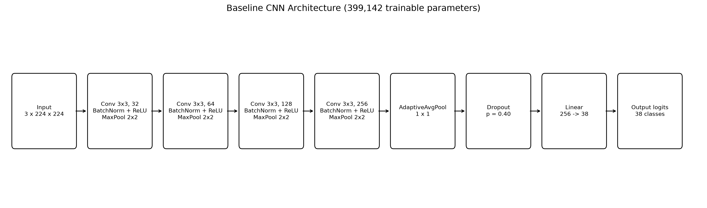
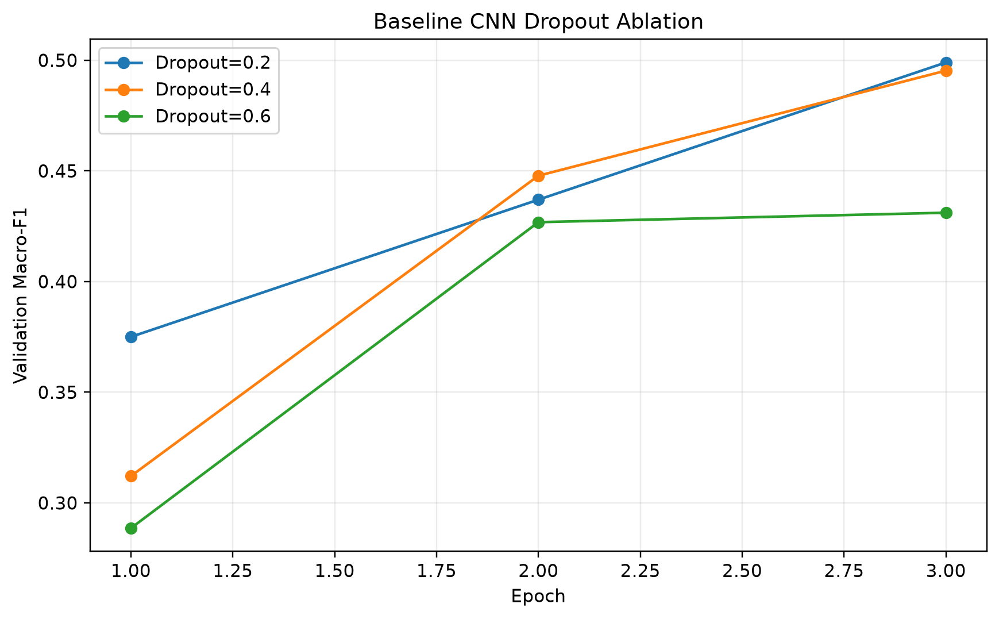
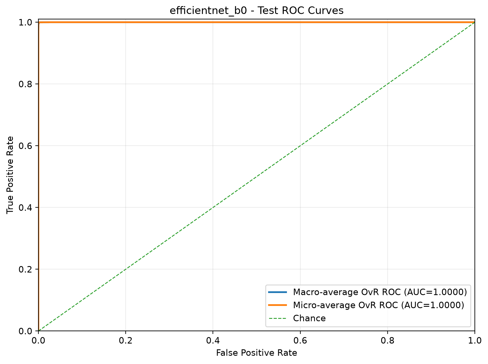

# Plant Disease Classification with PyTorch

**CENG 476 - Introduction to Deep Learning**  
**Student:** Emir Evren  
**Student ID:** 210444038  
**Task:** 38-class PlantVillage image classification  
**Framework:** PyTorch 2.11.0 + CUDA

## Overview

This project compares a convolutional neural network designed and trained from scratch with ImageNet-pretrained ResNet18 and EfficientNet-B0 models. The study includes controlled learning-rate and dropout experiments, regularization, learning-rate scheduling, early stopping logic, locked-test evaluation, class-level error analysis, a validation-tuned soft-voting ensemble, and Grad-CAM explainability.

The best individual model is **EfficientNet-B0** with **99.52% test accuracy** and **0.9923 Macro-F1**. A 50:50 ResNet18 + EfficientNet-B0 soft-voting ensemble reaches **99.76% test accuracy** and **0.9950 Macro-F1**.

## Dataset and Split

PlantVillage contains **54,305 RGB leaf images across 38 classes**. Images are processed to `3 x 224 x 224` tensors.

| Split | Images | Purpose |
|---|---:|---|
| Train | 43,444 | Optimization and augmentation |
| Validation | 5,430 | Scheduler, checkpoint and hyperparameter decisions |
| Locked test | 5,431 | Final evaluation only |

The original validation directory is divided 50/50 using a **stratified split with seed 42**. Validation and test indices are checked to be disjoint. Because the dataset is imbalanced, **validation Macro-F1** is the primary checkpoint-selection metric.


## Models

### 1. Custom Baseline CNN - trained from scratch

```text
Input 3 x 224 x 224
 -> Conv(3->32) + BN + ReLU + MaxPool
 -> Conv(32->64) + BN + ReLU + MaxPool
 -> Conv(64->128) + BN + ReLU + MaxPool
 -> Conv(128->256) + BN + ReLU + MaxPool
 -> AdaptiveAvgPool(1 x 1)
 -> Dropout
 -> Linear(256 -> 38)
 -> raw logits
```

The baseline has **399,142 trainable parameters**. Batch Normalization follows every convolution. ReLU is used in hidden layers. The classifier outputs raw logits because `CrossEntropyLoss` internally applies the required log-softmax operation.



### 2. ResNet18 Transfer Learning

ImageNet-pretrained ResNet18 is fine-tuned end-to-end. The original classifier is replaced with `Dropout(0.30) + Linear(512, 38)`. The pretrained backbone uses a lower learning rate than the newly initialized classifier.

### 3. EfficientNet-B0 Transfer Learning

ImageNet-pretrained EfficientNet-B0 is fine-tuned end-to-end. The classifier is replaced with `Dropout(0.30) + Linear(1280, 38)`. EfficientNet-B0 uses native SiLU activations and provides the strongest individual-model result with substantially fewer parameters than ResNet18.

## Preprocessing and Regularization

Training augmentation:

- `RandomResizedCrop(224, scale=(0.80, 1.00))`
- horizontal flip, `p=0.50`
- rotation, `+/-15 degrees`
- brightness/contrast/saturation jitter, `0.20`
- ImageNet normalization

Validation and test preprocessing is deterministic: resize to 256, center crop to 224, tensor conversion, and ImageNet normalization.

Generalization techniques include **Batch Normalization, dropout, AdamW weight decay (`1e-4`), data augmentation, ReduceLROnPlateau, early stopping logic, best-checkpoint retention, and a locked-test protocol**.

## Optimization Strategy

All models use **AdamW** with `betas=(0.9, 0.999)` and unweighted `CrossEntropyLoss`.

| Setting | Baseline CNN | ResNet18 | EfficientNet-B0 |
|---|---:|---:|---:|
| Batch size | 64 | 32 | 32 |
| Maximum epochs | 15 | 12 | 12 |
| Backbone LR | `5e-4` | `1e-4` | `1e-4` |
| Classifier LR | `5e-4` | `5e-4` | `5e-4` |
| Final dropout | 0.40 | 0.30 | 0.30 |
| Weight decay | `1e-4` | `1e-4` | `1e-4` |
| Early-stopping patience | 6 | 5 | 5 |

`ReduceLROnPlateau` monitors validation loss with `factor=0.5`, `patience=2`, and `min_lr=1e-6`. Checkpoints are selected by validation Macro-F1. In the final fixed-length runs, the epoch limit was reached before early stopping fired, so early stopping is described as an implemented safeguard rather than falsely claimed to have terminated the final runs.

## Learning-Rate Experiment

The custom CNN was tested with three learning rates in three-epoch pilot runs: `1e-3`, `5e-4`, and `3e-4`. The selected full-run rate was `5e-4`, providing a stable speed/convergence compromise.

## Dropout Ablation

A controlled three-epoch dropout ablation was performed on the baseline CNN. Learning rate, batch size, weight decay, data split, seed, and epoch count were held constant; only dropout changed.

| Dropout | Best validation Macro-F1 | Best validation loss |
|---:|---:|---:|
| **0.20** | **0.4990** | **1.4561** |
| 0.40 | 0.4953 | 1.4768 |
| 0.60 | 0.4311 | 1.9552 |

Dropout `0.20` and `0.40` were close in the short pilot, while `0.60` clearly slowed learning and produced the weakest validation result. The experiment therefore supports the conclusion that excessive dropout caused underfitting in this short training window. The test set was not used for this ablation.



## Final Results

| Model | Parameters | Test accuracy | Test Macro-F1 | Weighted-F1 | Errors |
|---|---:|---:|---:|---:|---:|
| Baseline CNN | 399,142 | 87.42% | 0.8201 | 0.8711 | 683 |
| ResNet18 | 11,196,006 | 99.26% | 0.9869 | 0.9927 | 40 |
| EfficientNet-B0 | 4,056,226 | 99.52% | 0.9923 | 0.9952 | 26 |
| ResNet18 + EfficientNet-B0 | 15,252,232 | **99.76%** | **0.9950** | **0.9976** | **13** |


### ROC-AUC

The final EfficientNet-B0 test ROC analysis produced:

- **Macro-average ROC-AUC: 0.999986**
- **Micro-average ROC-AUC: 0.999990**



## Ensemble and Explainability

Candidate soft-voting weights were selected **only on validation Macro-F1**. The best eligible mixture was 50:50 ResNet18/EfficientNet-B0. The test set was not used for ensemble-weight selection.

Grad-CAM was generated for correct and incorrect EfficientNet-B0 predictions. The visualizations generally emphasize leaf lesions, texture, discoloration, and venation; confusing classes often share visually similar symptom patterns.

| Correct examples | Error examples |
|---|---|
|  |  |

## Reproducibility

Random seed `42` is set for Python, NumPy, PyTorch, and CUDA where applicable. CUDA deterministic behavior is enabled. The project stores experiment configurations, epoch histories, evaluation summaries, class reports, confusion matrices, predictions, and comparison tables.

Main commands:

```powershell
python -m venv .venv
.\.venv\Scripts\python.exe -m pip install --upgrade pip
.\.venv\Scripts\python.exe -m pip install torch==2.11.0 torchvision==0.26.0 --index-url https://download.pytorch.org/whl/cu130
.\.venv\Scripts\python.exe -m pip install -r requirements.txt

.\.venv\Scripts\python.exe src\download_data.py
.\.venv\Scripts\python.exe src\sanity_check.py

.\.venv\Scripts\python.exe src\train_baseline.py --epochs 15 --learning-rate 0.0005 --batch-size 64 --num-workers 2 --weight-decay 0.0001 --dropout 0.4 --run-name baseline_b64_lr5e4_full
.\.venv\Scripts\python.exe src\train_resnet18.py --epochs 12 --batch-size 32 --num-workers 2 --backbone-learning-rate 0.0001 --classifier-learning-rate 0.0005 --weight-decay 0.0001 --dropout 0.3 --run-name resnet18_b32_blr1e4_hlr5e4_full
.\.venv\Scripts\python.exe src\train_efficientnet.py --epochs 12 --batch-size 32 --num-workers 2 --backbone-learning-rate 0.0001 --classifier-learning-rate 0.0005 --weight-decay 0.0001 --dropout 0.3 --run-name efficientnet_b0_b32_blr1e4_hlr5e4_full

.\.venv\Scripts\python.exe src\analyze_dropout_experiments.py
.\.venv\Scripts\python.exe src\generate_architecture_diagram.py
.\.venv\Scripts\python.exe src\generate_roc_curves.py --checkpoint outputs\checkpoints\efficientnet_b0_b32_blr1e4_hlr5e4_full_best.pt --batch-size 32
.\.venv\Scripts\python.exe src\compare_models.py
.\.venv\Scripts\python.exe src\evaluate_ensemble.py --batch-size 32
.\.venv\Scripts\python.exe src\generate_gradcam.py --batch-size 32 --num-correct 6 --num-errors 6
```

## Repository Structure

| Path | Description |
|---|---|
| `src/` | Data, model, training, evaluation, ensemble and explainability code |
| `notebooks/` | Main executed experiment notebook |
| `outputs/experiments/` | Saved experiment settings |
| `outputs/histories/` | Epoch-level training histories |
| `outputs/evaluation/` | Locked-test metrics and predictions |
| `outputs/comparison/` | Model and ablation comparison tables |
| `outputs/figures/` | Training, ROC, confusion, architecture, ablation and Grad-CAM figures |
| `requirements.txt` | Python dependencies excluding PyTorch wheels |

## Limitations

PlantVillage is largely a controlled-background dataset. Performance on its held-out test split should not be interpreted as guaranteed real-field performance. Further work should include independent field datasets, stronger domain-shift augmentation, repeated-seed uncertainty estimates, calibration, and deployment testing.

## References

1. D. P. Hughes and M. Salathe, *An Open Access Repository of Images on Plant Health to Enable the Development of Mobile Disease Diagnostics*, 2015.
2. S. P. Mohanty, D. P. Hughes, and M. Salathe, *Using Deep Learning for Image-Based Plant Disease Detection*, Frontiers in Plant Science, 2016.
3. K. He et al., *Deep Residual Learning for Image Recognition*, CVPR, 2016.
4. M. Tan and Q. V. Le, *EfficientNet: Rethinking Model Scaling for Convolutional Neural Networks*, ICML, 2019.
5. S. Ioffe and C. Szegedy, *Batch Normalization*, ICML, 2015.
6. N. Srivastava et al., *Dropout: A Simple Way to Prevent Neural Networks from Overfitting*, JMLR, 2014.
7. I. Loshchilov and F. Hutter, *Decoupled Weight Decay Regularization*, ICLR, 2019.
8. R. R. Selvaraju et al., *Grad-CAM*, ICCV, 2017.
