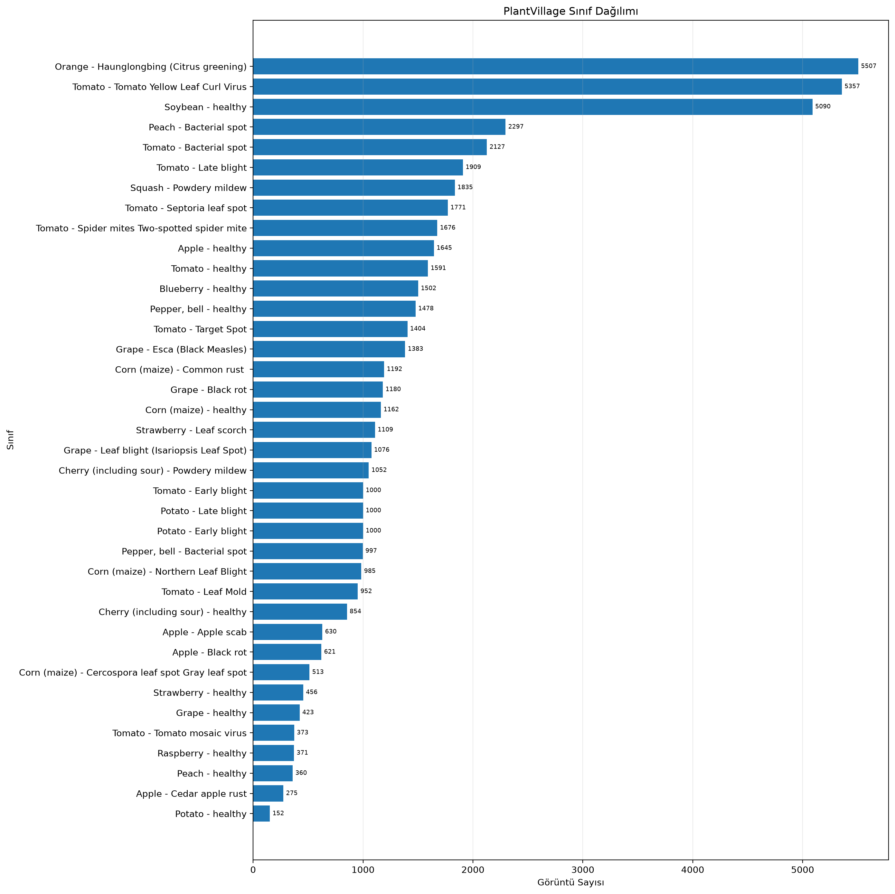
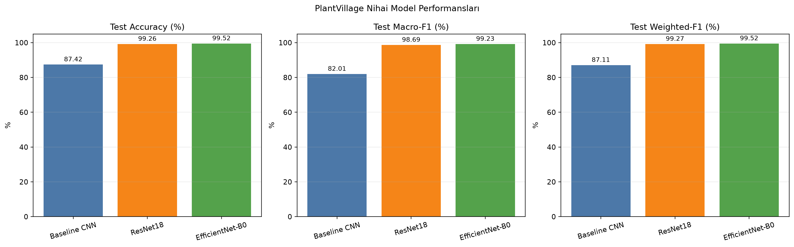
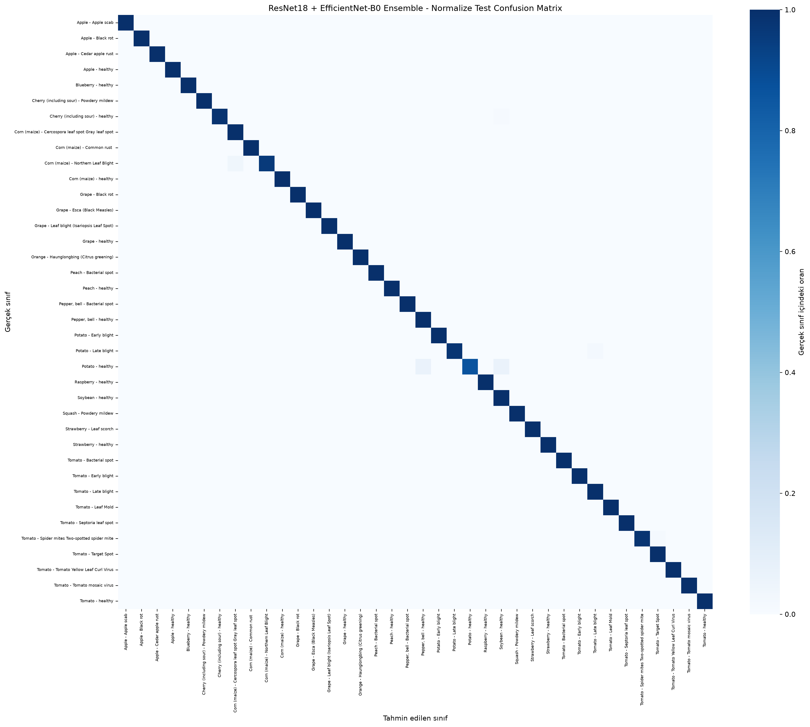
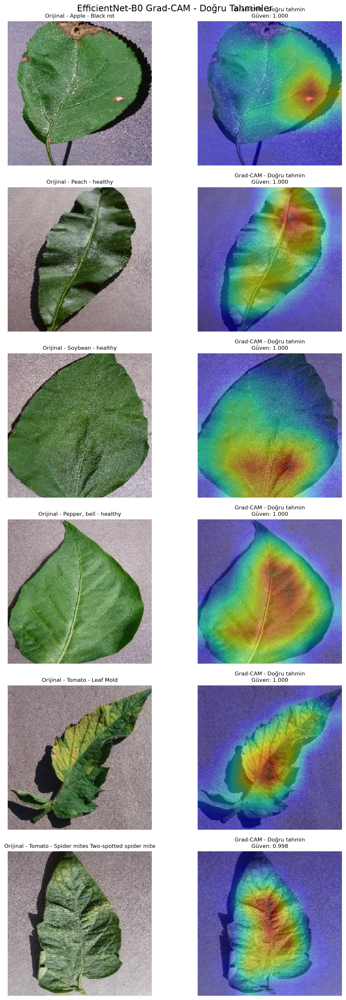
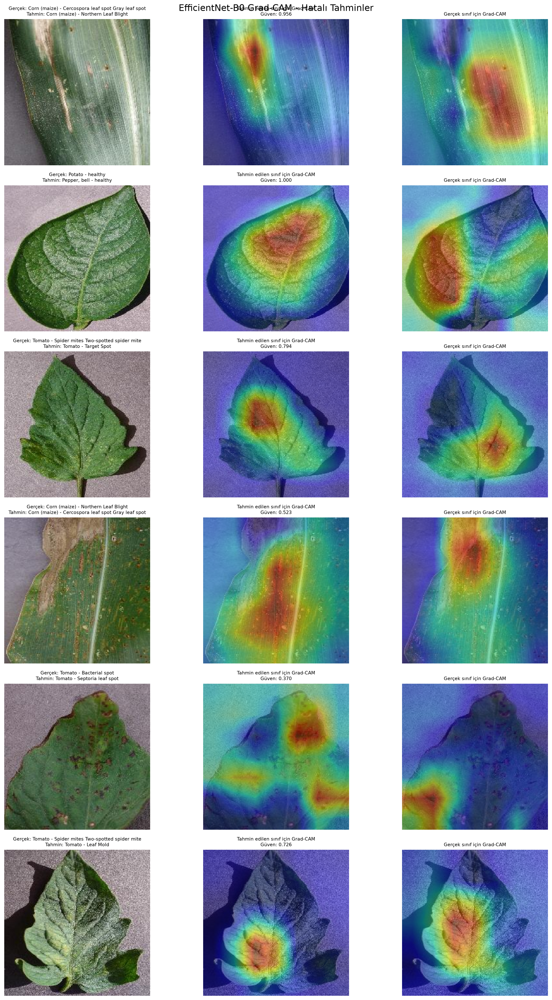

# Plant Disease Classification with PyTorch

**CENG 476 - Introduction to Deep Learning**  
**Student:** Emir Evren  
**Student ID:** 210444038  
**Framework:** PyTorch 2.11.0  
**Task:** 38-class plant disease classification

## Project Overview

This project investigates deep learning methods for recognizing plant diseases
from leaf images in the PlantVillage dataset. The study begins with a compact
convolutional neural network developed from scratch and then evaluates two
ImageNet-pretrained architectures, ResNet18 and EfficientNet-B0, under the same
data split and evaluation protocol.

The work was designed as a controlled model-development study rather than a
single training run. It includes data validation, a small-data overfitting
sanity check, learning-rate experiments, regularization analysis, transfer
learning, locked test evaluation, class-level error analysis, a
validation-tuned ensemble, and Grad-CAM explainability. The final ensemble
achieved **99.76% test accuracy** and **0.9950 macro-F1** on 5,431 previously
unseen test images.

## Research Objective

The main objective was to examine how model capacity, pretrained visual
features, regularization, and model combination affect performance on an
imbalanced multi-class image-classification problem. The study addresses four
questions:

1. How well can a lightweight CNN trained from scratch classify PlantVillage
   images?
2. How much improvement is obtained through transfer learning?
3. Can two complementary pretrained models reduce the remaining errors?
4. Do the trained models attend to visually meaningful regions of the leaves?

## Dataset and Evaluation Protocol

The project uses the PlantVillage dataset distributed through the Kaggle mirror
`mohitsingh1804/plantvillage`.

| Property | Value |
|---|---:|
| Total images | 54,305 |
| Number of classes | 38 |
| Training images | 43,444 |
| Validation images | 5,430 |
| Locked test images | 5,431 |
| Input format | RGB, `3 x 224 x 224` |
| Random seed | 42 |

The dataset's original training directory was retained as the training set.
Its original validation directory was divided into validation and test subsets
using a 50/50 stratified split. The resulting validation and test subsets have
no overlapping images and use an identical class-to-index mapping.

The class distribution is substantially imbalanced: the largest classes
contain several thousand images, while the smallest class contains only 152
images. For this reason, **validation macro-F1** was used as the primary model
selection metric. The test set remained locked during training, scheduler
updates, hyperparameter selection, checkpoint selection, and ensemble-weight
selection.



## Data Preparation

All images were converted to tensors and normalized with ImageNet mean and
standard-deviation values. Training augmentation was applied dynamically:

- random resized crop to `224 x 224`, scale range `0.80-1.00`;
- horizontal flip with probability `0.50`;
- random rotation within `+/-15` degrees;
- brightness, contrast, and saturation jitter of `0.20`;
- ImageNet normalization.

Validation and test images used deterministic preprocessing: resize to 256,
center crop to `224 x 224`, tensor conversion, and ImageNet normalization.
Augmentation was restricted to the training set.

## Model Architectures

### Baseline CNN

The baseline was implemented from scratch to provide an interpretable reference
point. It contains four feature-extraction blocks:

```text
Input (3 x 224 x 224)
  -> [Conv 3x3 -> BatchNorm -> ReLU -> MaxPool] x 4
  -> channels: 32 -> 64 -> 128 -> 256
  -> Adaptive Average Pooling
  -> Dropout(0.40)
  -> Linear(256, 38)
  -> 38 class logits
```

Batch normalization follows every convolution. ReLU supplies non-linearity,
max pooling reduces spatial resolution, and adaptive average pooling limits the
number of classifier parameters. The model contains **399,142 trainable
parameters**.

### ResNet18 Transfer Model

ResNet18 was initialized with ImageNet-pretrained weights. Its residual
connections support stable optimization through deeper feature hierarchies. The
original classification layer was replaced by `Dropout(0.30)` and a 38-output
linear layer. All layers were unfrozen and fine-tuned. The model contains
**11,196,006 parameters**.

### EfficientNet-B0 Transfer Model

EfficientNet-B0 was also initialized with ImageNet-pretrained weights and fully
fine-tuned. Its compound scaling and mobile inverted bottleneck blocks provide
a strong accuracy-to-parameter ratio. The classifier was replaced by
`Dropout(0.30)` and a 38-output linear layer. The model contains **4,056,226
parameters**, approximately 63.8% fewer than ResNet18.

The hidden layers use the native activations of each architecture: ReLU in the
baseline and ResNet18, and SiLU in EfficientNet-B0. Each model produces raw
logits during training. Cross-entropy loss applies the required log-softmax
internally; softmax probabilities are calculated only for inference and
evaluation.

## Training and Optimization Strategy

All models were optimized with AdamW and unweighted cross-entropy loss. The
weight-decay coefficient was **lambda = 1e-4**. This value is a regularization
strength, not an error margin: it discourages unnecessarily large weights while
the classification loss remains responsible for prediction error.

| Setting | Baseline CNN | ResNet18 | EfficientNet-B0 |
|---|---:|---:|---:|
| Batch size | 64 | 32 | 32 |
| Maximum epochs | 15 | 12 | 12 |
| Backbone learning rate | `5e-4` | `1e-4` | `1e-4` |
| Classifier learning rate | `5e-4` | `5e-4` | `5e-4` |
| Dropout | 0.40 | 0.30 | 0.30 |
| Weight decay | `1e-4` | `1e-4` | `1e-4` |
| Early-stopping patience | 6 | 5 | 5 |
| Best epoch | 15 | 12 | 10 |

Three baseline learning rates were examined in pilot experiments: `1e-3`,
`3e-4`, and `5e-4`. The `1e-3` run learned quickly but showed stronger
validation fluctuation, while `3e-4` converged more slowly. The intermediate
`5e-4` setting provided a better stability-speed balance and was selected for
the full baseline experiment.

The transfer models used differential learning rates. The pretrained backbone
was updated conservatively at `1e-4`, while the newly initialized classifier
was trained five times faster at `5e-4`. A `ReduceLROnPlateau` scheduler
monitored validation loss. After two epochs without sufficient improvement, it
multiplied the current learning rate by 0.5, with a lower bound of `1e-6`.

Model checkpoints were selected by validation macro-F1. Patience-based early
stopping was active as a safeguard against unnecessary training, while the best
validation checkpoint was preserved independently of the final epoch. Automatic
mixed precision was enabled on CUDA.

## Regularization and Generalization

Overfitting was addressed through several complementary mechanisms:

- **Batch normalization:** applied after each baseline convolution and already
  present throughout the pretrained architectures;
- **Dropout:** 0.40 for the baseline classifier and 0.30 for transfer-model
  classifiers;
- **L2-style regularization:** AdamW weight decay with `lambda = 1e-4`;
- **Data augmentation:** randomized crop, flip, rotation, and color variation;
- **Learning-rate reduction:** validation-loss-driven scheduling;
- **Early stopping and checkpointing:** controlled by validation performance;
- **Locked test protocol:** prevented indirect tuning on test results.

A balanced clean-training subset containing 20 images per class (760 images in
total) was evaluated without augmentation after each epoch. This provided a
more interpretable comparison between training and validation behavior than the
augmented training batches alone.

## Reliability Checks

Before full training, the baseline network was tested on a deliberately small
set containing one image from each of the 38 classes. Augmentation, dropout,
and weight decay were disabled for this diagnostic. The network reached 100%
accuracy after 40 optimization steps, confirming that the data-label mapping,
forward pass, loss calculation, backpropagation, and optimizer were connected
correctly.

Additional checks confirmed that:

- all 38 classes share the same index mapping across splits;
- validation and test subsets contain no common samples;
- model outputs have shape `[batch_size, 38]`;
- the test set is absent from every training and selection step.

## Experimental Results

| Model | Parameters | Val. macro-F1 | Test accuracy | Test macro-F1 | Weighted-F1 | Test errors |
|---|---:|---:|---:|---:|---:|---:|
| Baseline CNN | 399,142 | 0.8121 | 87.42% | 0.8201 | 0.8711 | 683 |
| ResNet18 | 11,196,006 | 0.9883 | 99.26% | 0.9869 | 0.9927 | 40 |
| EfficientNet-B0 | 4,056,226 | 0.9924 | 99.52% | 0.9923 | 0.9952 | 26 |
| ResNet18 + EfficientNet-B0 | 15,252,232 | **0.9936** | **99.76%** | **0.9950** | **0.9976** | **13** |



The results demonstrate the value of transfer learning for this task. Compared
with the baseline, EfficientNet-B0 improved test accuracy by 12.10 percentage
points and macro-F1 by 0.1722. It also outperformed ResNet18 while using
substantially fewer parameters.

The final ensemble reduced the EfficientNet-B0 error count from 26 to 13, a 50%
reduction relative to the strongest individual model. Its improvement in
macro-F1 indicates that the gain was not limited to the largest classes.

## Creative Extension 1: Validation-Tuned Ensemble

ResNet18 and EfficientNet-B0 were combined using weighted soft voting. Rather
than selecting weights on the test set, candidate combinations were compared
using validation macro-F1. The search evaluated EfficientNet/ResNet weights of
`0.25/0.75`, `0.50/0.50`, and `0.75/0.25`; single-model endpoints were retained
only as references.

The best validation result was obtained with equal weights:

```text
Combined probability = 0.50 x ResNet18 probability
                     + 0.50 x EfficientNet-B0 probability
```

The selected combination was then evaluated once on the locked test set. This
procedure improved performance without leaking test information into ensemble
design.



## Creative Extension 2: Grad-CAM Explainability

Grad-CAM was applied to the final convolutional feature stage of
EfficientNet-B0. Separate analyses were produced for correctly classified and
misclassified test examples. For errors, activation maps were generated for
both the predicted class and the true class.

The visualizations indicate that many correct decisions rely on leaf lesions,
discoloration, venation, and texture rather than only the image border. Error
cases frequently involve visually similar disease patterns, including the two
corn leaf-spot categories and related tomato symptoms. Grad-CAM is used here as
a qualitative interpretation tool, not as proof of causal reasoning.

| Correct prediction example | Error-analysis example |
|---|---|
|  |  |

## Main Findings

1. A compact CNN provides a meaningful baseline but is limited on minority and
   visually similar classes.
2. ImageNet transfer learning produces a large improvement in both accuracy and
   class-balanced macro-F1.
3. EfficientNet-B0 gives the strongest individual-model result and the best
   parameter efficiency.
4. ResNet18 and EfficientNet-B0 make partially complementary errors; equal
   soft-voting halves the remaining errors of EfficientNet-B0.
5. Grad-CAM generally highlights relevant leaf regions, although some errors
   show attention shared across similar symptoms.

## Limitations

PlantVillage images are mostly captured under controlled conditions with simple
backgrounds and limited environmental variation. Consequently, the reported
test scores describe performance on the held-out PlantVillage distribution and
should not be interpreted as equivalent field performance. Real agricultural
images may contain complex backgrounds, multiple leaves, occlusion, different
lighting conditions, and unseen disease stages.

Future work should include evaluation on independent field datasets, stronger
domain-shift augmentation, calibration analysis, uncertainty estimation, and
mobile deployment tests.

## Repository Contents

| Path | Description |
|---|---|
| `src/` | Data preparation, model definitions, training, evaluation, ensemble, and Grad-CAM code |
| `notebooks/` | Executed notebook presenting the main experimental workflow |
| `outputs/experiments/` | Saved hyperparameter configurations |
| `outputs/histories/` | Epoch-level training histories |
| `outputs/evaluation/` | Predictions, class reports, confusion matrices, and metric summaries |
| `outputs/comparison/` | Consolidated model-comparison tables |
| `outputs/figures/` | Dataset, training, evaluation, ensemble, and Grad-CAM figures |
| `report/` | Final project report in DOCX and PDF formats |
| `requirements.txt` | Non-PyTorch Python dependencies |

The main notebook is available at
[`notebooks/CENG476_Plant_Disease_Main_Experiments_Emir_Evren.ipynb`](notebooks/CENG476_Plant_Disease_Main_Experiments_Emir_Evren.ipynb).

## Reproducibility Reference

The original experiments were conducted on Windows with Python 3.14.3,
PyTorch 2.11.0+cu130, Torchvision 0.26.0+cu130, CUDA automatic mixed precision,
and an NVIDIA GeForce RTX 3050 Laptop GPU with 4 GB VRAM. Random seeds were
fixed where possible, and exact run settings are preserved under
`outputs/experiments/`.

The PlantVillage images and trained checkpoints are excluded from Git because
they are generated or large artifacts. The dataset is recreated by
`src/download_data.py`; training recreates the checkpoints in
`outputs/checkpoints/`.

<details>
<summary><strong>Canonical environment and experiment commands</strong></summary>

```powershell
python -m venv .venv
.\.venv\Scripts\python.exe -m pip install --upgrade pip
.\.venv\Scripts\python.exe -m pip install torch==2.11.0 torchvision==0.26.0 --index-url https://download.pytorch.org/whl/cu130
.\.venv\Scripts\python.exe -m pip install -r requirements.txt

.\.venv\Scripts\python.exe src\download_data.py
.\.venv\Scripts\python.exe src\data_setup.py
.\.venv\Scripts\python.exe src\sanity_check.py

.\.venv\Scripts\python.exe src\train_baseline.py --epochs 15 --learning-rate 0.0005 --batch-size 64 --num-workers 2 --weight-decay 0.0001 --dropout 0.4 --run-name baseline_b64_lr5e4_full

.\.venv\Scripts\python.exe src\train_resnet18.py --epochs 12 --batch-size 32 --num-workers 2 --backbone-learning-rate 0.0001 --classifier-learning-rate 0.0005 --weight-decay 0.0001 --dropout 0.3 --run-name resnet18_b32_blr1e4_hlr5e4_full

.\.venv\Scripts\python.exe src\train_efficientnet.py --epochs 12 --batch-size 32 --num-workers 2 --backbone-learning-rate 0.0001 --classifier-learning-rate 0.0005 --weight-decay 0.0001 --dropout 0.3 --run-name efficientnet_b0_b32_blr1e4_hlr5e4_full

.\.venv\Scripts\python.exe src\compare_models.py
.\.venv\Scripts\python.exe src\evaluate_ensemble.py --batch-size 32
.\.venv\Scripts\python.exe src\generate_gradcam.py --batch-size 32 --num-correct 6 --num-errors 6
```

</details>

## References

1. D. P. Hughes and M. Salathe, "An Open Access Repository of Images on Plant
   Health to Enable the Development of Mobile Disease Diagnostics," 2015.
   [arXiv:1511.08060](https://arxiv.org/abs/1511.08060)
2. K. He, X. Zhang, S. Ren, and J. Sun, "Deep Residual Learning for Image
   Recognition," CVPR, 2016.
   [Paper](https://arxiv.org/abs/1512.03385)
3. M. Tan and Q. Le, "EfficientNet: Rethinking Model Scaling for Convolutional
   Neural Networks," ICML, 2019.
   [Paper](https://arxiv.org/abs/1905.11946)
4. R. R. Selvaraju et al., "Grad-CAM: Visual Explanations from Deep Networks via
   Gradient-Based Localization," ICCV, 2017.
   [Paper](https://arxiv.org/abs/1610.02391)

