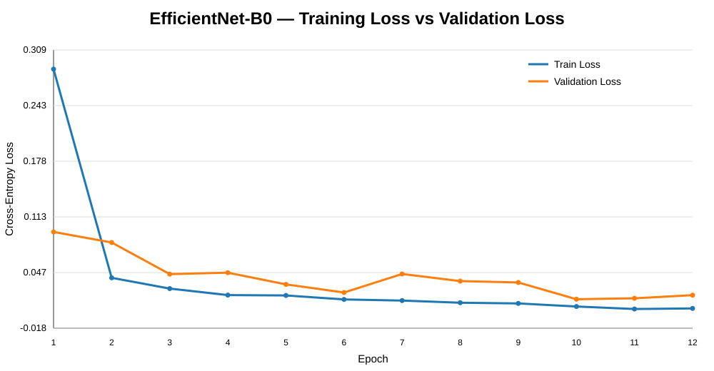
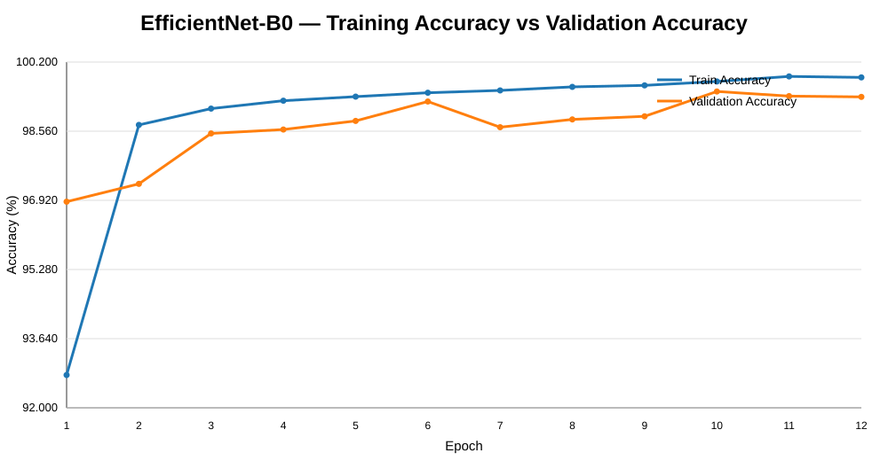
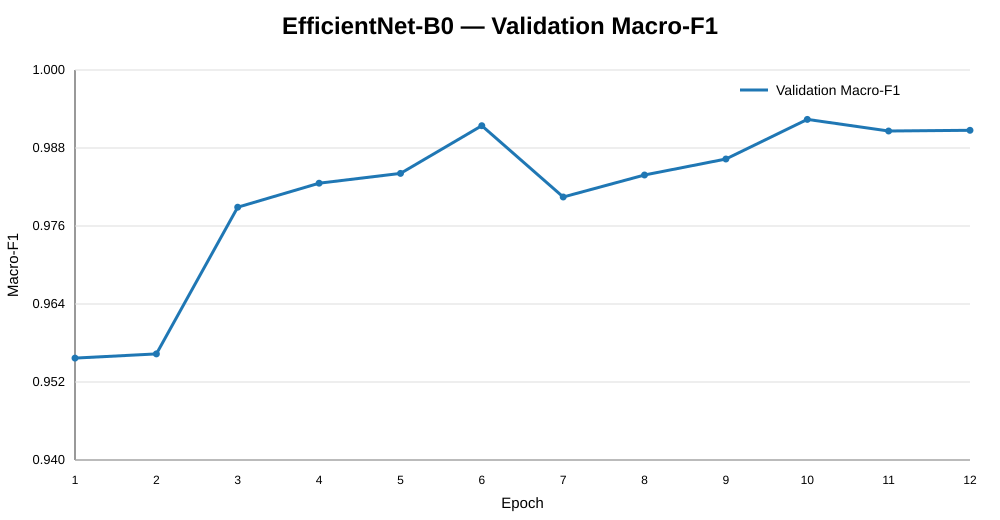
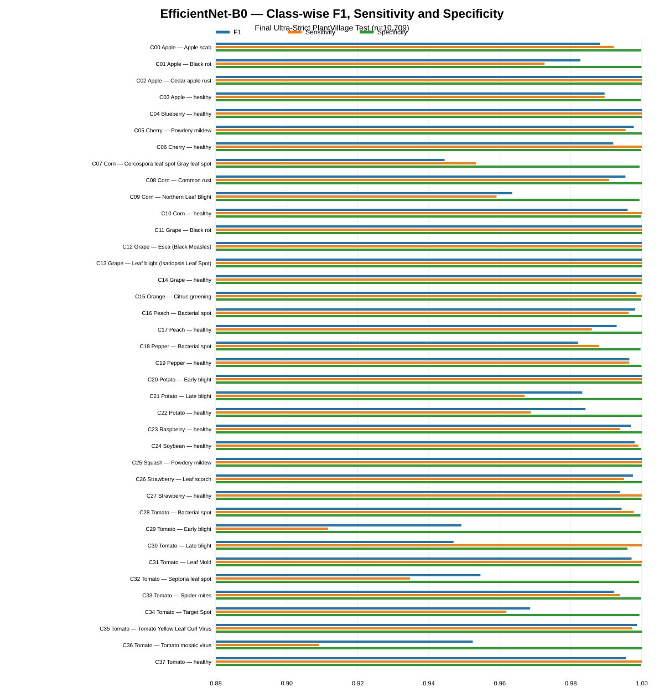

# Plant Disease Classification with PyTorch

**CENG 476 — Introduction to Deep Learning**  
**Student:** Emir Evren — **ID:** 210444038  
**Task:** 38-class PlantVillage image classification  
**Framework:** PyTorch + CUDA

## Project Focus

This project is presented primarily as a **model-development and training-methodology study**, not as a claim of architectural novelty. The central question is how preprocessing, augmentation, regularization, optimization, transfer learning, model selection and evaluation protocol affect the final classification performance.

The repository therefore documents not only the final scores, but also **what was applied, why it was applied, what parameter values were used, and what was observed**. The main methodology includes:

- fixed train / validation / locked-test evaluation,
- deterministic validation/test preprocessing,
- training-only data augmentation,
- Batch Normalization and nonlinear activations,
- dropout and AdamW weight-decay regularization,
- CrossEntropyLoss with raw logits,
- learning-rate pilots and differential transfer-learning rates,
- ReduceLROnPlateau scheduling,
- validation Macro-F1 checkpoint selection,
- early-stopping safeguards,
- train/validation curves and overfitting analysis,
- transfer learning with ResNet18 and EfficientNet-B0,
- validation-only soft-voting ensemble selection,
- leakage auditing and stricter split construction,
- multi-seed reproducibility, calibration, robustness and external-domain evaluation.

**Final audited benchmark:** Custom CNN **84.62%**, ResNet18 **97.66%**, EfficientNet-B0 **99.01%**, validation-selected 50/50 ensemble **99.14%**.

---

## 1. Assignment / Presentation Requirement Coverage

| Requirement | Project implementation | Main evidence |
|---|---|---|
| Custom architecture | Four-block CNN trained from scratch | `src/models.py`, notebook |
| Architecture explanation | Conv-BN-ReLU-MaxPool blocks, 3×3 kernels, adaptive pooling | notebook architecture section |
| Batch Normalization | after each convolution in Custom CNN | 4 BN layers |
| Dropout | 0.40 baseline, 0.30 transfer classifiers | controlled dropout pilot |
| Regularization | augmentation + dropout + AdamW weight decay `1e-4` | transforms/configs |
| Over/underfitting analysis | augmented train, clean train, validation and test comparison | histories + full-control audit |
| Optimizer | AdamW, betas `(0.9, 0.999)` | training scripts/configs |
| LR tuning | baseline pilots `1e-3`, `5e-4`, `3e-4` | experiment histories |
| Transfer LR strategy | backbone `1e-4`, classifier `5e-4` | transfer training scripts |
| Scheduler | ReduceLROnPlateau | factor 0.5, patience 2, min LR `1e-6` |
| Early stopping | patience 6 baseline / 5 transfer | implemented as safeguard |
| Activations | ReLU; EfficientNet native SiLU | model definitions |
| Data preprocessing | 224×224 input, ImageNet normalization | `src/data_setup.py` |
| Data augmentation | random crop, flip, rotation, ColorJitter | training transform only |
| Evaluation | fixed train / validation / locked test | **no k-fold CV** |
| Metrics | accuracy, precision, recall, F1, specificity, ROC-AUC, confusion matrix | evaluation/full-control outputs |
| Creative experiment | validation-selected soft-voting ensemble | 50/50 selected on validation only |
| Reproducibility | seed 42 + seeds 123/777 | seed stability outputs |

The notebook is intentionally organized so that the major sections follow this requirement list.

---

## 2. Data and Evaluation Strategy

The task is **single-label, 38-class image classification**. Model input tensors have shape `[B, 3, 224, 224]`; the classifier returns `[B, 38]` raw logits.

A fixed **train / validation / locked-test** design is used. **K-fold cross-validation was not used.** Repeating full deep-network fine-tuning across multiple folds would substantially increase compute cost, while a dedicated validation split and locked test were already maintained. Reproducibility was evaluated separately with multiple random seeds.

Final ultra-strict split:

| Split | Images | Role |
|---|---:|---|
| Train | **39,091** | gradient-based optimization + random augmentation |
| Validation | **4,462** | scheduler, checkpoint, hyperparameter and ensemble decisions |
| Locked test | **10,709** | final evaluation |
| Total | **54,262** | 38 classes |

The locked test set was not used for model training, checkpoint selection, hyperparameter tuning or ensemble-weight selection. Test images were included only in deterministic, model-independent duplicate / near-duplicate integrity auditing.

---

## 3. Preprocessing and Data Augmentation

### Training transform

```python
train_transform = transforms.Compose([
    transforms.RandomResizedCrop(224, scale=(0.80, 1.00)),
    transforms.RandomHorizontalFlip(p=0.5),
    transforms.RandomRotation(15),
    transforms.ColorJitter(
        brightness=0.2,
        contrast=0.2,
        saturation=0.2,
    ),
    transforms.ToTensor(),
    transforms.Normalize(
        mean=[0.485, 0.456, 0.406],
        std=[0.229, 0.224, 0.225],
    ),
])
```

**Why these transforms?** The crop changes framing and scale; horizontal flip removes unnecessary left/right orientation dependence; ±15° rotation introduces moderate viewpoint variation; ColorJitter changes illumination/contrast/saturation without intentionally destroying disease-related lesion color and texture. The augmentation is deliberately moderate.

### Validation / test transform

```text
Resize(256) → CenterCrop(224) → ToTensor() → ImageNet Normalize
```

Validation and test transforms are deterministic so the metric changes because of the model, not because a different random crop or rotation happened during evaluation. ImageNet normalization is used because ResNet18 and EfficientNet-B0 start from ImageNet-pretrained weights.

**Important claim boundary:** augmentation was retained in the final pipeline, but an augmentation-on/off single-variable ablation was not performed. Therefore the project does **not** claim that augmentation alone caused a specific percentage-point gain.

---

## 4. Custom CNN Architecture

```text
Input: 3×224×224
→ Conv(3→32, 3×3, padding=1) + BatchNorm + ReLU + MaxPool
→ Conv(32→64, 3×3, padding=1) + BatchNorm + ReLU + MaxPool
→ Conv(64→128, 3×3, padding=1) + BatchNorm + ReLU + MaxPool
→ Conv(128→256, 3×3, padding=1) + BatchNorm + ReLU + MaxPool
→ AdaptiveAvgPool(1×1)
→ Flatten
→ Dropout(0.40)
→ Linear(256→38)
→ raw logits
```

**Trainable parameters:** **399,142**.

Convolution is appropriate because disease symptoms are local visual structures such as lesions, texture and discoloration. `padding=1` preserves spatial size through each 3×3 convolution, while `MaxPool2d(2)` performs controlled downsampling. BatchNorm is placed after each convolution and before ReLU to stabilize intermediate activations. ReLU introduces the nonlinearity required to model complex decision boundaries.

---

## 5. Transfer Learning Models

### ResNet18

- ImageNet pretrained.
- Full end-to-end fine-tuning.
- Replacement classifier: `Dropout(0.30) → Linear(512, 38)`.
- **11,196,006 trainable parameters**.
- Residual connections support gradient flow through the deeper network.

### EfficientNet-B0

- ImageNet pretrained.
- Full end-to-end fine-tuning.
- Replacement classifier: `Dropout(0.30) → Linear(1280, 38)`.
- **4,056,226 trainable parameters**.
- Retains EfficientNet's native SiLU activations.
- Best individual accuracy/parameter trade-off in this project.

Transfer learning is used because ImageNet-pretrained networks already contain useful generic visual representations such as edges, textures and shapes. Full fine-tuning allows those representations to adapt to the plant-disease domain.

---

## 6. Loss, Softmax and Optimization

All final models use **unweighted `nn.CrossEntropyLoss()` with raw logits**.

```python
criterion = nn.CrossEntropyLoss()
logits = model(images)
loss = criterion(logits, labels)
```

Softmax is intentionally **not** applied before the loss. PyTorch `CrossEntropyLoss` expects raw logits and internally performs the numerically stable LogSoftmax / negative-log-likelihood computation. Softmax is used later only when probabilities are required for ensemble voting, confidence, ROC or calibration analysis.

Optimizer: **AdamW**

```python
AdamW(
    ...,
    betas=(0.9, 0.999),
    weight_decay=1e-4,
)
```

The mini-batch training order is:

```text
zero_grad → forward → CrossEntropyLoss → backward → optimizer.step
```

AMP is enabled on CUDA to reduce memory use and accelerate suitable operations.

---

## 7. Learning Rate, Scheduler and Early Stopping

### Baseline LR pilots

The Custom CNN was tested with `1e-3`, `5e-4` and `3e-4` pilot learning rates. The final baseline uses **`5e-4`**.

### Differential LR for transfer learning

- pretrained backbone: **`1e-4`**
- newly initialized classifier: **`5e-4`**

The backbone is updated more conservatively because it already contains useful pretrained visual features; the new classifier needs larger updates to adapt to the 38 target classes.

### Scheduler

`ReduceLROnPlateau` monitors **validation loss**:

```text
factor = 0.5
patience = 2
min_lr = 1e-6
```

Validation loss is a smooth optimization signal for detecting a plateau. The best checkpoint is selected instead using **validation Macro-F1**, because Macro-F1 gives equal importance to every one of the 38 classes. Validation loss is the tie-breaker.

### Early stopping

- Custom CNN patience: **6**
- transfer-model patience: **5**

Early stopping is implemented as a safeguard. The selected final runs reached their configured maximum epoch before the early-stopping condition terminated training; therefore the repository does not claim that early stopping itself stopped those selected runs.

---

## 8. Dropout / Regularization Experiment

Controlled baseline dropout pilot:

| Dropout | Best validation Macro-F1 | Interpretation |
|---:|---:|---|
| 0.20 | **0.4990** | similar to 0.40 in short pilot |
| 0.40 | **0.4953** | predefined final baseline value |
| 0.60 | **0.4311** | too aggressive; learning was suppressed |

The 0.20/0.40 difference was small. The final baseline was not retroactively redefined using test performance. Other regularization in the final pipeline includes training augmentation and AdamW weight decay `1e-4`.

---

## 9. Sanity Check Before Long Training

A tiny **38-image intentional-overfit test** was used before long GPU runs. This is an implementation sanity check, not a generalization test.

Recorded behavior:

```text
step 30 → 71.05% training accuracy
step 40 → 100.00% training accuracy
```

If the network could not fit a tiny set, that would raise suspicion about the labels, forward pass, loss, backward pass or optimizer update. Reaching 100% supported that the basic training pipeline was functioning.

---

## 10. Presentation-Aligned Training Curves

The following figures are the project-specific equivalents of the example presentation's loss/accuracy plots. They are generated from the recorded EfficientNet-B0 model-development/full-training history in `outputs/histories/efficientnet_b0_b32_blr1e4_hlr5e4_full_history.csv`.

> **Provenance note:** these epoch curves are used to explain training methodology and optimization behavior. They are not relabeled as ultra-strict training curves. Final audited test metrics are reported separately from the ultra-strict evaluation outputs.

### Loss vs validation loss



### Accuracy vs validation accuracy



### Validation Macro-F1



In the recorded development run, the learning rate is `1e-4` through epoch 9 and becomes `5e-5` from epoch 10, illustrating the LR-reduction behavior. The development validation Macro-F1 peaks around epoch 10.

---

## 11. Overfitting / Generalization Analysis

A deterministic **clean-train subset of 20 images per class = 760 images** is evaluated without random augmentation. This allows the training distribution to be compared more fairly with validation/test preprocessing.

| Model | Clean-train accuracy | Validation accuracy | Final test accuracy |
|---|---:|---:|---:|
| Custom CNN | 77.89% | 83.55% | 84.62% |
| ResNet18 | 98.16% | 98.81% | 97.66% |
| EfficientNet-B0 | 99.74% | 98.68% | 99.01% |

The transfer models do not show the large same-domain train-to-validation collapse expected from severe conventional training-image memorization. The larger limitation appears when the domain changes, as shown by PlantDoc.

The clean-train subset is balanced and contains only 760 images, so its value is used as a diagnostic rather than as a replacement for the full train metric.

---

## 12. Evaluation Metrics

For each class:

```text
Precision = TP / (TP + FP)
Recall / Sensitivity = TP / (TP + FN)
F1 = 2 × Precision × Recall / (Precision + Recall)
Specificity = TN / (TN + FP)
```

**Macro-F1** computes F1 independently for every class and gives all 38 classes equal weight. **Weighted-F1** weights classes according to their test support. ROC-AUC is evaluated in a one-vs-rest multiclass setting.

The project-specific classification figures are generated from the **final ultra-strict EfficientNet confusion matrix and per-class CSVs**:

- `outputs/audit/full_control/efficientnet_confusion_matrix.csv`
- `outputs/audit/full_control/efficientnet_per_class.csv`

### Class-wise F1, sensitivity and specificity



The corresponding complete figures/tables can be regenerated with:

```powershell
.\.venv\Scripts\python.exe src\generate_presentation_metrics.py
```

The script produces:

- loss vs validation loss,
- accuracy vs validation accuracy,
- validation Macro-F1,
- 38-class F1 / sensitivity / specificity,
- raw and row-normalized confusion matrices,
- class-ID legend,
- two detailed classification-report tables,
- overall classification summary,
- lowest class-wise F1 plot,
- reusable per-class metric CSV including one-vs-rest specificity.

---

## 13. Final Ultra-Strict Results

| Model | Parameters | Accuracy | Macro-F1 | Weighted-F1 | Macro ROC-AUC | Errors |
|---|---:|---:|---:|---:|---:|---:|
| Custom CNN | 399,142 | **84.62%** | 0.7813 | 0.8361 | 0.995589 | 1,647 |
| ResNet18 | 11,196,006 | **97.66%** | 0.9686 | 0.9763 | 0.999929 | 251 |
| EfficientNet-B0 | 4,056,226 | **99.01%** | **0.9874** | 0.9901 | 0.999955 | 106 |
| 50/50 ensemble | 15,252,232 | **99.14%** | **0.9897** | 0.9914 | 0.999976 | **92** |

The strongest individual model is EfficientNet-B0. The validation-selected ensemble gives the highest overall final test score.

### Main EfficientNet error pattern

The final confusion matrix contains **106 errors**. The largest individual off-diagonal confusions include:

- Tomato Septoria leaf spot → Tomato Late blight: **17**
- Tomato Early blight → Tomato Late blight: **11**
- Potato Late blight → Tomato Late blight: **7**
- Corn Northern Leaf Blight → Corn Cercospora/Gray leaf spot: **7**
- Corn Cercospora/Gray leaf spot → Corn Northern Leaf Blight: **5**

This provides more useful diagnostic information than accuracy alone.

---

## 14. Ensemble Selection

The ensemble uses **soft voting** on class probabilities:

```text
Pensemble = 0.5 × PResNet18 + 0.5 × PEfficientNet
```

Candidate weights were compared on **validation data only**:

| ResNet / EfficientNet | Validation Macro-F1 |
|---:|---:|
| 100 / 0 | 0.986237 |
| 75 / 25 | 0.988722 |
| **50 / 50** | **0.992033** |
| 25 / 75 | 0.986400 |
| 0 / 100 | 0.982431 |

The 50/50 weight was therefore selected before final test evaluation. Test performance was not used to choose the ensemble weight.

---

## 15. Why the Historical 99.76% Was Rejected

The original image-level split contained documented overlap:

- exact cross-split duplicates: **10**
- perceptual near-duplicate pairs: **68**
- mapped same-physical-leaf cross-split groups: **4,956**

The final strict review found **39** `dHash≤4` cross-split pairs. With priority `test > validation > train`, **34 train + 4 validation + 0 test** images were quarantined.

Under the implemented final audit protocol there is no detected exact, mapped-leaf or strict `dHash≤4` cross-split overlap. This does **not** mathematically prove unique physical specimens for every unmapped image because physical-leaf mapping covers approximately 75.7% of the dataset.

The correct interpretation is that the original split was optimistic, while the near-99% controlled-domain performance still remained after substantially stricter evaluation. The full original-to-final difference must not be attributed causally to leakage alone because both split protocol and training/evaluation conditions changed.

---

## 16. Reproducibility, Negative Control and Uncertainty

### Seed stability

| Seed | Test accuracy | Macro-F1 | Errors |
|---:|---:|---:|---:|
| 42 | 99.010% | 0.987373 | 106 |
| 123 | 98.767% | 0.983668 | 132 |
| 777 | 99.225% | 0.990149 | 83 |

Mean accuracy: **99.001%**; standard deviation: **0.229 percentage points**. Seed 777 is not cherry-picked as the headline result.

### Random-label sanity check

With shuffled training labels, true-label validation accuracy was **1.84%** and Macro-F1 **0.0183**, close to the 38-class random chance level of **2.63%**. This is evidence against trivial pipeline/label leakage, but it is not proof that every possible form of leakage is impossible.

### Calibration / bootstrap

EfficientNet-B0:

- ECE: **0.003845**
- NLL: **0.035704**
- Brier score: **0.016145**
- 1,000-sample bootstrap accuracy 95% CI: approximately **98.81%–99.20%**

Bootstrap here is ordinary sample bootstrap, not a stratified bootstrap.

---

## 17. Robustness and Interpretability

Representative EfficientNet robustness results:

| Condition | Accuracy |
|---|---:|
| Clean | 99.01% |
| Brightness 0.60 | 98.83% |
| Brightness 1.40 | 98.07% |
| Contrast 0.60 | 98.49% |
| JPEG quality 30 | 98.13% |
| Rotation 15° | 99.41% |
| Gaussian blur radius 2 | **84.08%** |
| Large center occlusion | **55.38%** |

The model is comparatively robust to moderate brightness/contrast/JPEG/rotation changes and much more sensitive to blur and large occlusion. This stress test suggests reliance on fine visual details, but it does not prove a specific causal shortcut.

Grad-CAM figures are stored under `outputs/figures/full_control/`. Grad-CAM is used only as **supportive qualitative evidence**, not as causal proof that the network exclusively relies on disease lesions.

---

## 18. External PlantDoc Evaluation

PlantDoc is used as a **zero-shot external / out-of-domain stress test** with manual semantic mapping to PlantVillage labels and no retraining.

| Model | Accuracy | Mapped Macro-F1 |
|---|---:|---:|
| EfficientNet-B0 | **23.31%** | 0.2183 |
| 50/50 ensemble | **25.00%** | 0.2349 |

The mapped subset contains **236 images across 27 mapped source classes**. Because the ontology mapping is manual, this is an external stress test rather than a directly comparable 38-class benchmark.

The large drop indicates **strong domain dependence / poor cross-domain transfer**, not simple proof that the model memorized individual training images. Within PlantVillage, train/validation/test remain close; outside PlantVillage, acquisition conditions, background, framing and visual distribution change substantially.

---

## 19. What Changed, Why, and What Happened

| Development step | Why it was changed / tested | Observed outcome |
|---|---|---|
| Scratch Custom CNN | establish transparent baseline | 84.62% final test accuracy |
| ResNet18 transfer learning | test pretrained feature reuse | 97.66% |
| EfficientNet-B0 | improve parameter efficiency and accuracy | 99.01%, best individual |
| Dropout pilot | study regularization strength | 0.60 clearly too aggressive |
| LR pilots | avoid arbitrary baseline LR | final baseline 5e-4 |
| Differential transfer LR | protect pretrained backbone, adapt new head faster | retained in final transfer setup |
| ReduceLROnPlateau | refine optimization after validation-loss plateau | LR reduction visible in recorded development history |
| Validation Macro-F1 checkpoint | balanced 38-class selection | avoids selecting only by overall accuracy |
| 50/50 ensemble | combine complementary probabilities | 99.14%, 92 errors |
| Leakage audit | investigate suspicious historical 99.76% | exact/near/same-leaf overlap detected |
| Ultra-strict protocol | produce more defensible evaluation | 99.14% ensemble remains |
| Multiple seeds | test lucky-run hypothesis | 99.001% ± 0.229 pp |
| Random-label control | test for trivial pipeline leakage | chance-level validation; PASS |
| PlantDoc | test external validity | 23–25%; strong domain shift |

This table captures the presentation's main methodology message: **method → reason → measurable observation**.

---

## 20. Notebook and Reproduction

Main notebook:

`notebooks/CENG476_Plant_Disease_Main_Experiments_Emir_Evren.ipynb`

The notebook contains implementation cells, recorded outputs, methodology explanations, experimental comparisons, per-class metric generation and final validation evidence.

Environment setup:

```powershell
python -m venv .venv
.\.venv\Scripts\python.exe -m pip install --upgrade pip
.\.venv\Scripts\python.exe -m pip install -r requirements.txt
```

Main pipelines:

```bat
call .\run_ultrastrict_all.bat
call .\run_full_control_all.bat
```

Presentation metric figures:

```powershell
.\.venv\Scripts\python.exe src\generate_presentation_metrics.py
```

---

## Repository Structure

| Path | Purpose |
|---|---|
| `src/` | preprocessing, models, training, evaluation, auditing and figure-generation code |
| `notebooks/` | main experiment notebook |
| `outputs/histories/` | recorded training histories |
| `outputs/figures/` | training curves and evaluation figures |
| `outputs/figures/presentation_metrics/` | methodology-aligned presentation figures |
| `outputs/audit/full_control/` | final predictions, confusion matrix, per-class metrics, calibration, robustness and stability evidence |
| `report/` | final report and validation summary |
| `run_ultrastrict_all.bat` | final ultra-strict model pipeline |
| `run_full_control_all.bat` | extended validation pipeline |

---

## Final Interpretation

The main contribution is the **controlled model-development process** rather than a new architecture. A scratch CNN establishes the baseline; regularization and validation-driven optimization define the training methodology; transfer learning provides the largest performance improvement; validation-only ensembling adds a smaller gain; and leakage/OOD audits establish the limits of the result.

Under the final audited PlantVillage protocol, EfficientNet-B0 achieves **99.01%** and the 50/50 ensemble **99.14%**. These results are reproducible across seeds within the controlled PlantVillage domain. They must **not** be interpreted as near-99% real-world field accuracy: the PlantDoc experiment demonstrates a substantial domain-generalization gap.
